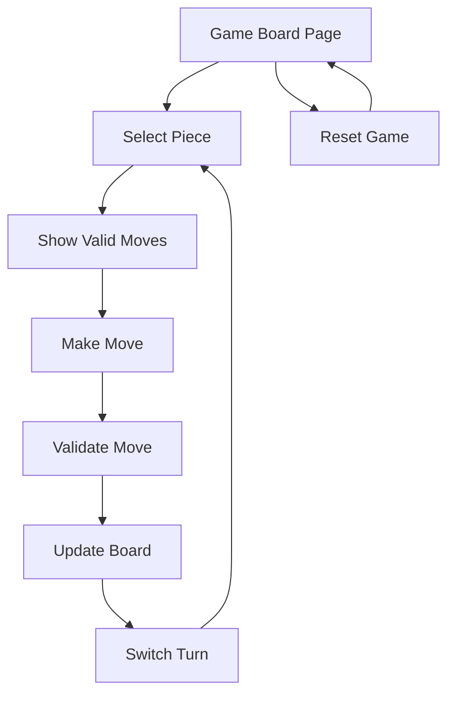

# Modern Chess Game Web Client - Product Requirements Document

## 1. Product Overview
A modern, interactive chess game web client designed for demonstration purposes, featuring clean visual design and intuitive piece movement mechanics.
The application focuses on core chess gameplay functionality including board rendering, piece movement validation, and move highlighting to showcase chess game mechanics in a web environment.
Target market: Educational demonstrations, chess learning platforms, and web development portfolios.

## 2. Core Features

### 2.1 User Roles
No user role distinction is required for this demo application. All users have the same access level and functionality.

### 2.2 Feature Module
Our chess game requirements consist of the following main pages:
1. **Game Board Page**: chess board display, piece positioning, move interaction system, game status indicators.
2. **Game Controls**: move history display, reset game functionality, turn indicators.

### 2.3 Page Details

| Page Name | Module Name | Feature description |
|-----------|-------------|---------------------|
| Game Board Page | Chess Board Display | Render 8x8 chess board with alternating light/dark squares, proper coordinate labels (a-h, 1-8) |
| Game Board Page | Piece Positioning | Display all chess pieces in standard starting positions with distinct visual representations for each piece type |
| Game Board Page | Move Interaction | Enable piece selection via click, highlight selected piece, show valid move squares when piece is selected |
| Game Board Page | Drag and Drop | Allow pieces to be moved via drag-and-drop interface with visual feedback during dragging |
| Game Board Page | Move Validation | Implement chess rules for each piece type (pawn, rook, bishop, knight, queen, king) including castling moves and prevent invalid moves |
| Game Board Page | Turn Management | Alternate between white and black turns, display current player indicator |
| Game Controls | Move History | Display list of moves made in Standard Algebraic Notation (SAN) with move numbers, disambiguation, captures, and check indicators |
| Game Controls | Game Reset | Provide button with confirmation dialog to reset board to starting position and clear move history |
| Game Controls | Status Display | Show game status with visual indicators: "Check!" warning, "Checkmate - [Winner] Wins!", "Stalemate - Draw!", and current player turn |

## 3. Core Process
The main user operation flow involves selecting pieces and making moves:

1. User views the chess board in starting position
2. User clicks on a piece (only pieces of current turn color are selectable)
3. System highlights the selected piece and shows all valid move squares
4. User either clicks on a valid destination square or drags the piece to it
5. System validates the move, updates board position, and switches turns
6. Process repeats until game completion or reset

## 4. User Interface Design
### 4.1 Design Style
- Primary colors: Warm wood tones (#D2B48C for light squares, #8B4513 for dark squares)
- Secondary colors: Highlight blue (#4A90E2) for selected pieces, green (#7ED321) for valid moves
- Button style: Modern flat design with subtle shadows and rounded corners
- Font: Clean sans-serif (Inter or Roboto) with 16px base size for UI elements
- Layout style: Centered board layout with side panels for controls and move history
- Icon style: Minimalist chess piece symbols with clear contrast and elegant typography

### 4.2 Page Design Overview

| Page Name | Module Name | UI Elements |
|-----------|-------------|-------------|
| Game Board Page | Chess Board Display | 8x8 grid with alternating colors, subtle border shadows, coordinate labels in elegant typography |
| Game Board Page | Piece Positioning | High-quality chess piece icons with smooth edges, consistent sizing, and clear piece differentiation |
| Game Board Page | Move Interaction | Smooth hover effects, blue highlight for selected pieces, semi-transparent green dots for valid moves |
| Game Board Page | Drag and Drop | Smooth dragging animation, piece follows cursor, drop zones highlighted during drag |
| Game Controls | Move History | Scrollable panel with Standard Algebraic Notation, move numbers, and from/to square display |
| Game Controls | Game Reset | Reset button that opens confirmation dialog to prevent accidental resets, with "Reset Game" and "Cancel" options |
| Game Controls | Status Display | Dynamic status messages with color coding: red for checkmate, yellow for stalemate, orange for check, blue for active play |

### 4.3 Responsiveness
Desktop-first design with mobile-adaptive layout. Touch interaction optimization for mobile devices including larger touch targets and gesture-based piece movement. Board scales proportionally on smaller screens while maintaining playability.

## 5. Non-Functional Requirements
- Robust input validation for drag-and-drop interactions; invalid data must be ignored with no side effects.
- Graceful error handling via a UI error boundary showing a friendly fallback and a Reset option.
- Client-side logging for invalid drag data and unexpected exceptions in DnD handlers.
- Accessibility: semantic roles and names for board, squares, and controls; keyboard and touch operability; live status announcements.

## 6. Maintainability
- Eliminate magic numbers; use BOARD_SIZE for board dimensions and any related calculations.
- Centralize validation utilities in utils/chessUtils.ts (isValidDragData, sanitizeSquareInput, isValidSquare).

## 7. Acceptance Criteria
- Invalid drag payloads or malformed squares are ignored; no move is dispatched.
- Dropping onto the same square is prevented and does not alter state.
- Errors within ChessBoard/ChessSquare/ChessPiece render or DnD logic do not crash the app; a fallback is displayed with Reset.
- Move generation uses BOARD_SIZE consistently (e.g., rook/bishop ray lengths), and coordinate conversions use BOARD_SIZE.

## 8. Constraints & Out of Scope
- Castling moves are fully implemented with proper validation and execution ✅
- En passant capture implemented ✅
- Pawn promotion is not yet implemented

## 9. Check Detection Requirements (Implemented)
- The system MUST prevent any move that leaves the moving side's king in check (self-check moves are illegal). ✅
- The system MUST set isInCheck to true when, after a move, the opponent's king is attacked; and recompute correctly after undo. ✅

### 9.1 Acceptance Criteria
- getValidMoves returns only legal moves (self-check moves are filtered out). ✅
- After MAKE_MOVE, isInCheck reflects whether the opponent's king is in check in the resulting position. ✅
- After UNDO_MOVE, isInCheck is recalculated for the side to move and reflects the restored position accurately. ✅

## 10. Endgame Detection Requirements (Implemented)
- The system MUST detect checkmate when a player's king is in check and has no legal moves. ✅
- The system MUST detect stalemate when a player is not in check but has no legal moves. ✅
- The system MUST display appropriate endgame messages with winner announcement or draw indication. ✅

### 10.1 Acceptance Criteria
- hasAnyLegalMoves() correctly identifies when a player has no valid moves. ✅
- isCheckmate() returns true only when king is in check AND no legal moves exist. ✅
- isStalemate() returns true only when king is NOT in check AND no legal moves exist. ✅
- Game status updates automatically after each move to reflect endgame conditions. ✅
- Undo functionality remains available after game end for position review. ✅

## 11. Move Notation Requirements (Implemented)
- Moves MUST be displayed in Standard Algebraic Notation (SAN). ✅
- Notation MUST include piece letters (K, Q, R, B, N), except for pawns. ✅
- Captures MUST be indicated with 'x' (e.g., "Bxe5", "exd4"). ✅
- Check MUST be indicated with '+' and checkmate with '#'. ✅
- Disambiguation MUST be used when multiple pieces can make the same move. ✅

## 12. User Confirmation Requirements (Implemented)
- Reset game action MUST show a confirmation dialog before clearing the board. ✅
- Confirmation dialog MUST be accessible with keyboard navigation (Escape to cancel). ✅
- Dialog MUST have clear "Reset Game" and "Cancel" options. ✅
- Dialog MUST prevent accidental game resets through explicit confirmation. ✅

## 13. Undo/Redo Requirements (Implemented)
- The system MUST provide undo functionality to revert the last move. ✅
- The system MUST provide redo functionality to replay undone moves. ✅
- Undo MUST properly restore piece positions, capture states, and castling rights. ✅
- Redo MUST accurately replay moves with proper notation and state updates. ✅
- Making a new move MUST clear the redo history. ✅

### 13.1 Acceptance Criteria
- Undo button is disabled when moveHistory is empty. ✅
- Redo button is disabled when redoHistory is empty. ✅
- Castling moves are properly undone/redone (both king and rook positions). ✅
- Game status (check/checkmate/stalemate) is recalculated after undo/redo. ✅

## 14. Castling Requirements (Implemented)
- The system MUST support both king-side (O-O) and queen-side (O-O-O) castling. ✅
- Castling MUST only be allowed when all conditions are met: ✅
  - King and rook have not moved
  - No pieces between king and rook
  - King is not in check
  - King does not move through check
  - King does not end in check
- The rook MUST automatically move to the correct position when castling. ✅
- Castling notation MUST display as "O-O" or "O-O-O" in move history. ✅

## 15. En Passant Requirements (Implemented)
- The system MUST support en passant capture according to official chess rules
- En passant MUST only be allowed when all conditions are met:
  - Opponent pawn moves exactly 2 squares from starting position
  - Capturing pawn is on the 5th rank (white) or 4th rank (black)
  - Capturing pawn is adjacent to the moved pawn
  - En passant must be performed immediately on the next turn
- The captured pawn MUST be removed from the board (not the destination square)
- En passant notation MUST display as "exd6 e.p." in move history
- Undo/redo MUST properly restore the captured pawn and game state

### 15.1 UI/UX Requirements for En Passant
- Valid en passant moves MUST be highlighted like other valid moves
- The captured pawn MUST visually disappear when en passant is executed
- Move history MUST clearly indicate en passant with "e.p." notation
- Drag-and-drop MUST work seamlessly for en passant moves

### 15.2 Game State Tracking Requirements
- System MUST track the last move to determine en passant eligibility
- En passant target square MUST be stored in game state when applicable
- Game state MUST include en passant eligibility flag
- Move validation MUST check en passant conditions accurately

### 15.3 Acceptance Criteria
- En passant moves appear in valid moves when conditions are met
- Captured pawn is removed from correct square (not destination)
- En passant eligibility expires after one turn if not used
- Undo restores both the capturing pawn and captured pawn positions
- Check detection works correctly after en passant captures
- En passant moves are properly validated to prevent self-check

## 16. Testing Requirements
- Unit tests MUST be provided for core game logic
- Test coverage includes:
  - Move validation for all piece types
  - Check detection algorithms
  - Board state management
  - Castling rights updates
  - En passant validation and execution
  - UI interactions (GameControls, ConfirmationDialog) and DnD flows (ChessSquare/ChessPiece)
  - Accessibility basics: jest-axe checks, keyboard-only flows (Enter/Space), touch tap-to-move
- Testing framework: Vitest with React Testing Library
- Tests are located in `src/**/__tests__/` directories

## 17. Accessibility Requirements (Implemented)
- Board semantics: role=group with accessible name; squares are role=button with accessible names and are focusable
- Keyboard interaction: Enter/Space to select/move; Escape cancels dialogs
- Live status announcements via role=status and aria-live=polite
- Touch interaction: tap-to-select, tap-to-move

## 18. Verification and Quality Gates
- Coverage thresholds enforced via vitest.config.ts: statements ≥ 80%, lines ≥ 80%, functions ≥ 80%, branches ≥ 70%.
- CI uploads coverage to Codecov using GitHub Actions; coverage badge is displayed in README.
- Husky pre-commit hook runs lint and a quick subset of tests to catch issues early.
