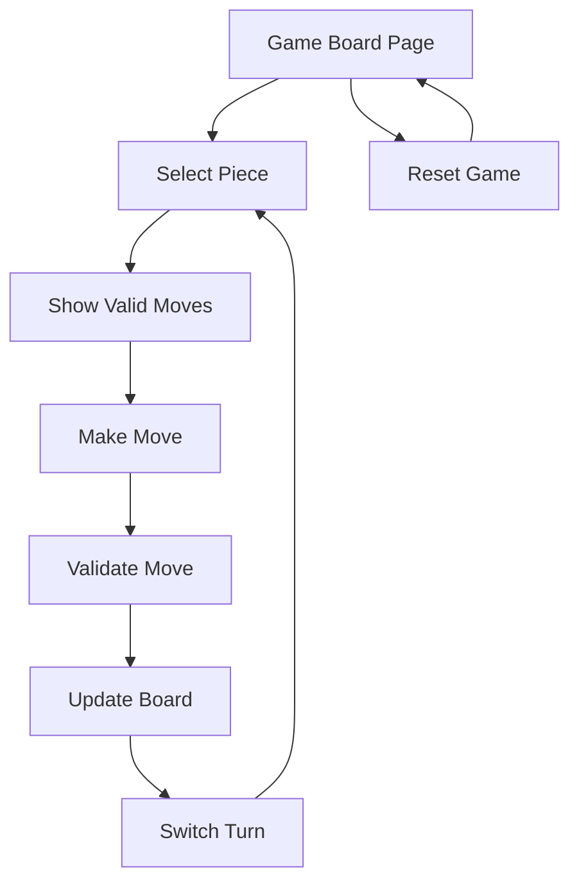

# Modern Chess Game Web Client - Product Requirements Document

## 1. Product Overview
A modern, interactive chess game web client designed for demonstration purposes, featuring clean visual design and intuitive piece movement mechanics.
The application focuses on core chess gameplay functionality including board rendering, piece movement validation, and move highlighting to showcase chess game mechanics in a web environment.
Target market: Educational demonstrations, chess learning platforms, and web development portfolios.

## 2. Core Features

### 2.1 User Roles
No user role distinction is required for this demo application. All users have the same access level and functionality.

### 2.2 Feature Module
Our chess game requirements consist of the following main pages:
1. **Game Board Page**: chess board display, piece positioning, move interaction system, game status indicators.
2. **Game Controls**: move history display, reset game functionality, turn indicators.

### 2.3 Page Details

| Page Name | Module Name | Feature description |
|-----------|-------------|---------------------|
| Game Board Page | Chess Board Display | Render 8x8 chess board with alternating light/dark squares, proper coordinate labels (a-h, 1-8) |
| Game Board Page | Piece Positioning | Display all chess pieces in standard starting positions with distinct visual representations for each piece type |
| Game Board Page | Move Interaction | Enable piece selection via click, highlight selected piece, show valid move squares when piece is selected |
| Game Board Page | Drag and Drop | Allow pieces to be moved via drag-and-drop interface with visual feedback during dragging |
| Game Board Page | Move Validation | Implement chess rules for each piece type (pawn, rook, bishop, knight, queen, king) including castling moves and prevent invalid moves |
| Game Board Page | Turn Management | Alternate between white and black turns, display current player indicator |
| Game Controls | Move History | Display list of moves made in algebraic notation with move numbers |
| Game Controls | Game Reset | Provide button to reset board to starting position and clear move history |
| Game Controls | Undo/Redo | Provide buttons to undo previous moves and redo previously undone moves |
| Game Controls | Status Display | Show game status (active, check, checkmate, stalemate) and current turn |

## 3. Core Process
The main user operation flow involves selecting pieces and making moves:

1. User views the chess board in starting position
2. User clicks on a piece (only pieces of current turn color are selectable)
3. System highlights the selected piece and shows all valid move squares
4. User either clicks on a valid destination square or drags the piece to it
5. System validates the move, updates board position, and switches turns
6. Process repeats until game completion or reset

## 4. User Interface Design
### 4.1 Design Style
- Primary colors: Warm wood tones (#D2B48C for light squares, #8B4513 for dark squares)
- Secondary colors: Highlight blue (#4A90E2) for selected pieces, green (#7ED321) for valid moves
- Button style: Modern flat design with subtle shadows and rounded corners
- Font: Clean sans-serif (Inter or Roboto) with 16px base size for UI elements
- Layout style: Centered board layout with side panels for controls and move history
- Icon style: Minimalist chess piece symbols with clear contrast and elegant typography

### 4.2 Page Design Overview

| Page Name | Module Name | UI Elements |
|-----------|-------------|-------------|
| Game Board Page | Chess Board Display | 8x8 grid with alternating colors, subtle border shadows, coordinate labels in elegant typography |
| Game Board Page | Piece Positioning | High-quality chess piece icons with smooth edges, consistent sizing, and clear piece differentiation |
| Game Board Page | Move Interaction | Smooth hover effects, blue highlight for selected pieces, semi-transparent green dots for valid moves |
| Game Board Page | Drag and Drop | Smooth dragging animation, piece follows cursor, drop zones highlighted during drag |
| Game Controls | Move History | Scrollable panel with monospace font, alternating row colors, move numbering |
| Game Controls | Game Reset | Prominent reset button with confirmation dialog, modern button styling |
| Game Controls | Undo/Redo | Undo and Redo buttons with proper enable/disable states, consistent styling with other controls |
| Game Controls | Status Display | Clear turn indicator with player colors, status messages in readable typography |

### 4.3 Responsiveness
Desktop-first design with mobile-adaptive layout. Touch interaction optimization for mobile devices including larger touch targets and gesture-based piece movement. Board scales proportionally on smaller screens while maintaining playability.

## 5. Non-Functional Requirements
- Robust input validation for drag-and-drop interactions; invalid data must be ignored with no side effects.
- Graceful error handling via a UI error boundary showing a friendly fallback and a Reset option.
- Client-side logging for invalid drag data and unexpected exceptions in DnD handlers.

## 6. Maintainability
- Eliminate magic numbers; use BOARD_SIZE for board dimensions and any related calculations.
- Centralize validation utilities in utils/chessUtils.ts (isValidDragData, sanitizeSquareInput, isValidSquare).

## 7. Acceptance Criteria
- Invalid drag payloads or malformed squares are ignored; no move is dispatched.
- Dropping onto the same square is prevented and does not alter state.
- Errors within ChessBoard/ChessSquare/ChessPiece render or DnD logic do not crash the app; a fallback is displayed with Reset.
- Move generation uses BOARD_SIZE consistently (e.g., rook/bishop ray lengths), and coordinate conversions use BOARD_SIZE.

## 8. Constraints & Out of Scope
- Castling moves are fully implemented with proper validation and execution ✅
- En passant capture remains out of scope for this iteration
- Pawn promotion is not yet implemented

## 9. Check Detection Requirements (Implemented)
- The system MUST prevent any move that leaves the moving side's king in check (self-check moves are illegal). ✅
- The system MUST set isInCheck to true when, after a move, the opponent's king is attacked; and recompute correctly after undo. ✅

### 9.1 Acceptance Criteria
- getValidMoves returns only legal moves (self-check moves are filtered out). ✅
- After MAKE_MOVE, isInCheck reflects whether the opponent's king is in check in the resulting position. ✅
- After UNDO_MOVE, isInCheck is recalculated for the side to move and reflects the restored position accurately. ✅

## 10. Testing Requirements
- Unit tests MUST be provided for core game logic
- Test coverage includes:
  - Move validation for all piece types
  - Check detection algorithms
  - Board state management
  - Castling rights updates
- Testing framework: Vitest with React Testing Library
- Tests are located in `src/**/__tests__/` directories
