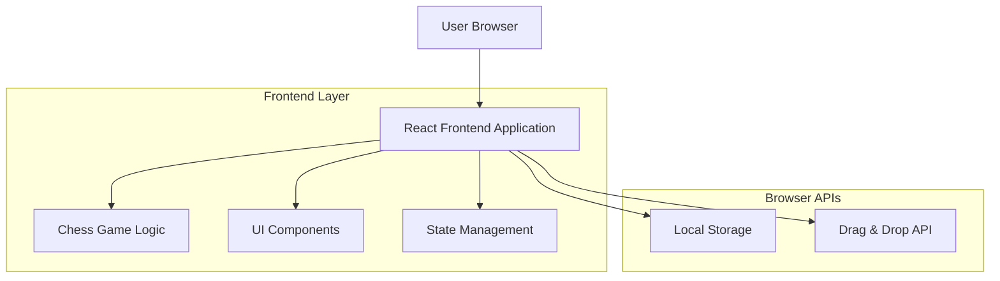
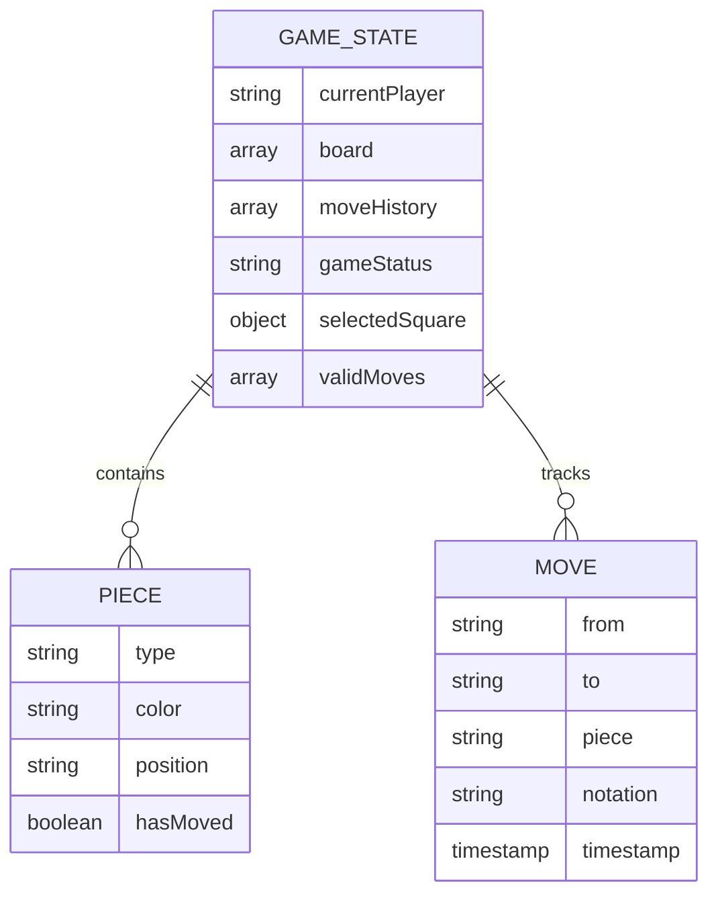

# Modern Chess Game Web Client - Technical Architecture Document

## 1. Architecture design



## 2. Technology Description

* Frontend: React\@18 + TypeScript\@5 + Vite\@5 + Tailwind CSS\@3

* State Management: React Context API + useReducer

* Chess Logic: Custom TypeScript implementation

* Styling: Tailwind CSS with custom chess board components

* Build Tool: Vite for fast development and optimized builds

## 3. Route definitions

| Route | Purpose                                      |
| ----- | -------------------------------------------- |
| /     | Main chess game page with board and controls |

## 4. API definitions

No backend APIs required for this demo application. All functionality is handled client-side.

## 5. Server architecture diagram

No server-side architecture required. This is a pure frontend application.

## 6. Data model

### 6.1 Data model definition



### 6.2 Data Definition Language

TypeScript interfaces for the chess game data structures:

```typescript
// Core game types
type PieceType = 'pawn' | 'rook' | 'knight' | 'bishop' | 'queen' | 'king';
type PieceColor = 'white' | 'black';
type Square = string; // e.g., 'e4', 'a1'
type GameStatus = 'active' | 'check' | 'checkmate' | 'stalemate' | 'draw';

// Piece interface
interface ChessPiece {
  type: PieceType;
  color: PieceColor;
  hasMoved: boolean;
}

// Castling rights interface
interface CastlingRights {
  white: { kingSide: boolean; queenSide: boolean };
  black: { kingSide: boolean; queenSide: boolean };
}

// Move interface
interface Move {
  from: Square;
  to: Square;
  piece: ChessPiece;
  notation: string;
  timestamp: Date;
  captured?: ChessPiece;
  // State tracking for proper undo functionality
  prevHasMoved: boolean;
  prevCapturedHasMoved?: boolean;
  prevCastlingRights: CastlingRights;
  // En passant tracking
  isEnPassant?: boolean;
  enPassantCaptureSquare?: Square; // Square where captured pawn was located
  prevEnPassantTarget?: Square | null; // Previous en passant target for undo
}

// Board state (8x8 array)
type Board = (ChessPiece | null)[][];

// Game state interface
interface GameState {
  board: Board;
  currentPlayer: PieceColor;
  moveHistory: Move[];
  redoHistory: Move[];  // Stack of moves that can be redone
  gameStatus: GameStatus;
  selectedSquare: Square | null;
  validMoves: Square[];
  isInCheck: boolean;
  castlingRights: CastlingRights;
  enPassantTarget: Square | null; // Target square for en passant capture
}
}

// Component props interfaces
interface ChessBoardProps {
  gameState: GameState;
  onSquareClick: (square: Square) => void;
  onPieceDrop: (from: Square, to: Square) => void;
}

interface ChessPieceProps {
  piece: ChessPiece;
  square: Square;
  isSelected: boolean;
  isValidMove: boolean;
  onDragStart: (square: Square) => void;
  onDragEnd: (from: Square, to: Square) => void;
}

interface GameControlsProps {
  gameState: GameState;
  onResetGame: () => void;
  onUndoMove: () => void;
  onRedoMove: () => void;
}
}

// Chess logic utility types
interface MoveValidationResult {
  isValid: boolean;
  reason?: string;
  wouldBeInCheck?: boolean;
}

interface SquareInfo {
  file: string; // a-h
  rank: number; // 1-8
  color: 'light' | 'dark';
  coordinates: [number, number]; // [row, col] in array
}
```

### Component Architecture

```typescript
// Main application component structure
interface ComponentHierarchy {
  App: {
    ErrorBoundary: {  // Error boundary wrapper for graceful error handling
      ChessGame: {
        ChessBoard: {
          ChessSquare: {
            ChessPiece: {};
          };
        };
        GameControls: {
          MoveHistory: {};  // Displays moves in Standard Algebraic Notation
          GameStatus: {};   // Shows current player, check/checkmate/stalemate
          ActionButtons: {}; // Reset (with confirmation) and Undo buttons
          ConfirmationDialog: {}; // Modal for reset confirmation
        };
      };
    };
  };
}

// UI Component Types (from src/types/ui.ts)
interface ConfirmationDialogProps {
  isOpen: boolean;
  title: string;
  message: string;
  confirmText?: string;
  cancelText?: string;
  onConfirm: () => void;
  onCancel: () => void;
}

// State management actions
type GameAction = 
  | { type: 'SELECT_SQUARE'; square: Square }
  | { type: 'MAKE_MOVE'; from: Square; to: Square }
  | { type: 'RESET_GAME' }
  | { type: 'UNDO_MOVE' }
  | { type: 'REDO_MOVE' }
  | { type: 'SET_VALID_MOVES'; moves: Square[] }
  | { type: 'UPDATE_GAME_STATUS'; status: GameStatus }
  | { type: 'SET_EN_PASSANT_TARGET'; target: Square | null };
```

## 10. Check Detection and Legal Move Filtering (Implemented)

- Move validation (utils/moveValidation.ts)
  - findKingPosition(board, color): locate the king square for a color.
  - isKingInCheck(board, color, kingSquare?): determines if a king is attacked by scanning opponent pseudo-legal moves.
  - getPawnAttacks(board, from, piece): special function for pawn diagonal attacks (used in check detection).
  - isMoveLegal(board, from, to, piece): simulates a move and returns false if it leaves own king in check.
  - getValidMoves(...) now filters out moves that would place own king in check.
  - getKingMoves(...) includes full castling validation with safety checks.
- Game reducer (hooks/useChessGame.ts)
  - After MAKE_MOVE: computes opponent check state via isKingInCheck(newBoard, opponent) and sets gameState.isInCheck.
  - After UNDO_MOVE: recomputes isInCheck for the next current player based on the restored board.
  - Handles castling move execution by moving both king and rook.
  - Supports castling move undo by restoring both pieces to original positions.
  - Sets gameStatus to 'check' when player is in check but game continues.

## 11. Testing Architecture

- Testing framework: Vitest with React Testing Library
- Test organization:
  - Unit tests located in `src/**/__tests__/` directories
  - Tests for components: `src/components/__tests__/` (ChessBoard, ChessSquare/ChessPiece DnD, GameControls, ConfirmationDialog, ErrorBoundary)
  - Tests for hooks: `src/hooks/__tests__/useChessGame*.test.ts`
  - Tests for utilities: `src/utils/__tests__/`
- Test commands:
  - `npm test` - run the suite
  - `npm run test:ui` - open Vitest UI for interactive testing
  - `npm run test:coverage` - run with coverage (text, lcov, html)
- Quality gates:
  - Coverage thresholds enforced in vitest.config.ts (statements ≥ 80%, lines ≥ 80%, functions ≥ 80%, branches ≥ 70%)
  - CI uploads coverage to Codecov via GitHub Actions (badge in README)
  - Husky pre-commit runs lint and a quick subset of tests
- Coverage includes:
  - Chess utility functions (coordinate conversion, board initialization)
  - Game state reducer logic
  - Move validation and check detection
  - Castling rights management
  - UI interactions (GameControls, ConfirmationDialog) and DnD flows (ChessSquare/ChessPiece)

## 12. Endgame Detection (Implemented)

- Checkmate and Stalemate Detection (utils/moveValidation.ts)
  - hasAnyLegalMoves(board, color): checks if a player has any legal moves by scanning all pieces
  - isCheckmate(board, color): returns true if player is in check AND has no legal moves
  - isStalemate(board, color): returns true if player is NOT in check but has no legal moves
- Game State Updates (hooks/useChessGame.ts)
  - After each move, automatically detects endgame conditions
  - Sets gameStatus to 'checkmate' when checkmate is detected
  - Sets gameStatus to 'stalemate' when stalemate is detected
  - Sets gameStatus to 'check' when king is in check but game continues
  - Sets gameStatus to 'active' for normal play
- UI Updates (components/GameControls.tsx)
  - Displays "Checkmate - [Winner] Wins!" with winner announcement
  - Displays "Stalemate - Draw!" for stalemate situations
  - Displays "Check!" warning when king is under attack
  - Undo remains enabled after game end to allow review of final position

## 13. Standard Algebraic Notation (SAN) System (Implemented)

- Move Notation Generation (utils/chessUtils.ts)
  - generateAlgebraicNotation(board, piece, from, to, captured, gameStatus): creates standard chess notation
  - Piece notation: K (King), Q (Queen), R (Rook), B (Bishop), N (Knight), pawns have no letter
  - Disambiguation: adds file (a-h) or rank (1-8) when multiple pieces can make the same move
  - Capture notation: uses 'x' for captures (e.g., "Bxe5", "exd4")
  - Check/Checkmate: appends '+' for check, '#' for checkmate
  - Special moves: "O-O" for kingside castling, "O-O-O" for queenside
- En passant notation: "exd6 e.p." implemented; promotion notation supported (e.g., "e8=Q"). Promotion move execution is out of scope for now.
- Move History Display
  - All moves shown in standard chess notation in GameControls
  - Includes move numbers and from/to squares for clarity
  - Professional chess notation for better game analysis

## 14. Castling Implementation (Fully Implemented)

- Move Validation (utils/moveValidation.ts)
  - getKingMoves() accepts castlingRights parameter for castling validation
  - Validates all castling conditions:
    - King and rook haven't moved
    - Path between king and rook is clear
    - King is not in check
    - King doesn't move through or into check
  - Adds castling squares (g1/g8 for kingside, c1/c8 for queenside) to valid moves
- Move Execution (hooks/useChessGame.ts)
  - Detects castling moves (king moving 2 squares horizontally)
  - Automatically moves rook to correct position (f-file for kingside, d-file for queenside)
  - Updates castling rights after king or rook moves
- Undo/Redo Support
  - Properly restores both king and rook positions when undoing castling
  - Restores hasMoved flags for both pieces
  - Maintains castling rights history through moves
- Notation
  - Displays "O-O" for kingside castling
  - Displays "O-O-O" for queenside castling
  - Properly appends check/checkmate indicators

## 15. Undo/Redo System (Implemented)

- State Management
  - moveHistory: Array of completed moves
  - redoHistory: Stack of undone moves available for redo
  - Making a new move clears redoHistory
- Undo Operation (UNDO_MOVE action)
  - Removes last move from moveHistory
  - Restores board state to previous position
  - Handles special cases (castling, captures)
  - Adds undone move to redoHistory
  - Recalculates game status and check state
- Redo Operation (REDO_MOVE action)
  - Takes last move from redoHistory
  - Re-executes the move on the board
  - Restores move to moveHistory
  - Maintains all move metadata and notation
- UI Controls (GameControls.tsx)
  - Undo button disabled when moveHistory is empty
  - Redo button disabled when redoHistory is empty
  - Visual feedback with hover states and disabled states

## 16. En Passant Implementation (Implemented)

### 16.1 Move Validation (utils/moveValidation.ts)
- getPawnMoves() includes:
  - Check if opponent's last move was a 2-square pawn advance
  - Validate capturing pawn is on correct rank (5th for white, 4th for black)
  - Verify capturing pawn is adjacent to the moved pawn
  - Add en passant target square to valid moves when conditions met
- isEnPassantMove() utility function:
  - Determines if a move is an en passant capture
  - Validates all en passant conditions are satisfied
  - Returns capture square location (different from destination)
- Move validation:
  - Check that en passant doesn't leave king in check
  - Validate en passant eligibility expires after one turn

### 16.2 Game State Management (hooks/useChessGame.ts)
- En Passant Target Tracking:
  - Set enPassantTarget when pawn moves 2 squares from starting position
  - Clear enPassantTarget after each move (expires immediately)
  - Store previous enPassantTarget in move history for undo
- MAKE_MOVE Action:
  - Detect en passant moves by checking destination vs capture square
  - Remove captured pawn from correct square (not destination)
  - Update enPassantTarget based on current move
  - Generate proper notation with "e.p." suffix
- UNDO_MOVE Action:
  - Restore captured pawn to original position
  - Restore previous enPassantTarget state
  - Handle en passant-specific undo logic
- REDO_MOVE Action:
  - Re-execute en passant capture logic
  - Maintain en passant state consistency

### 16.3 Notation System (utils/chessUtils.ts)
- generateAlgebraicNotation() updates:
  - Detect en passant moves via isEnPassant flag
  - Generate notation format: "exd6 e.p."
  - Handle disambiguation for en passant captures
  - Maintain check/checkmate indicators after en passant

### 16.4 Data Flow for En Passant
```typescript
// En passant detection flow
1. Opponent moves pawn 2 squares → set enPassantTarget
2. Current player selects pawn → getPawnMoves() checks en passant eligibility
3. Valid en passant move highlighted → user makes move
4. MAKE_MOVE detects en passant → removes captured pawn, updates notation
5. enPassantTarget cleared → eligibility expires

// En passant undo flow
1. UNDO_MOVE triggered → restore captured pawn to original square
2. Restore previous enPassantTarget → maintain state consistency
3. Recalculate game status → ensure check detection works correctly
```

### 16.5 Testing Requirements for En Passant
- Unit tests for en passant validation logic
- Integration tests for en passant execution and undo
- Edge case testing:
  - En passant preventing/causing check
  - Multiple en passant opportunities
  - En passant eligibility expiration
  - Undo/redo state consistency

## 17. User Experience Enhancements

- Confirmation Dialogs (components/ConfirmationDialog.tsx)
  - Reusable modal component for user confirmations
  - Used for reset game confirmation to prevent accidental resets
  - Accessible with keyboard navigation (Escape to cancel)
  - Focus management for better accessibility
- Smooth animations with fade and scale effects
- Reset Confirmation Flow
  - Reset button opens confirmation dialog
  - User must explicitly confirm to reset the game
  - Prevents accidental loss of game progress
- SSR-Safe Implementation
  - Portal-based rendering for proper modal layering
  - Guards against server-side rendering issues
  - Graceful mounting/unmounting with animations

## 18. Accessibility (Implemented)

- Semantic structure
  - Board uses role=group with accessible name "Chess board"; squares are role=button with accessible names like "e2 white pawn", "e4 empty"
  - Pieces inside squares are aria-hidden to avoid duplicate semantics
- Live status announcements
  - Game status is announced via role=status with aria-live=polite and aria-atomic=true (active/check/checkmate/stalemate)
- Keyboard interaction
  - Enter/Space on a square selects a piece or confirms a move to a destination from the currently selected square
  - Squares are focusable (tabIndex=0) and expose pressed state via aria-pressed when selected
- Touch interaction
  - Tap-to-select a piece; tap destination to move
- Visual feedback
  - Selected and valid-move highlights visible; cleared after move completes
- Testing
  - jest-axe used for basic a11y checks; integration tests for keyboard-only moves, touch tap-to-move, visual feedback, and DnD edge cases

## 19. CI, Coverage, and Developer Tooling

- Continuous Integration: GitHub Actions workflow runs lint and tests with coverage and uploads lcov to Codecov.
- Coverage thresholds: enforced via vitest.config.ts (statements ≥ 80%, lines ≥ 80%, functions ≥ 80%, branches ≥ 70%).
- Codecov: status checks and coverage reporting; badge present in README.
- Husky: pre-commit hook executes lint and a quick subset of tests to catch issues early.

