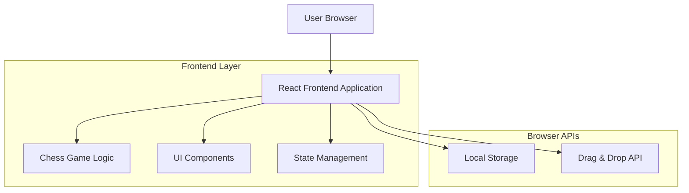
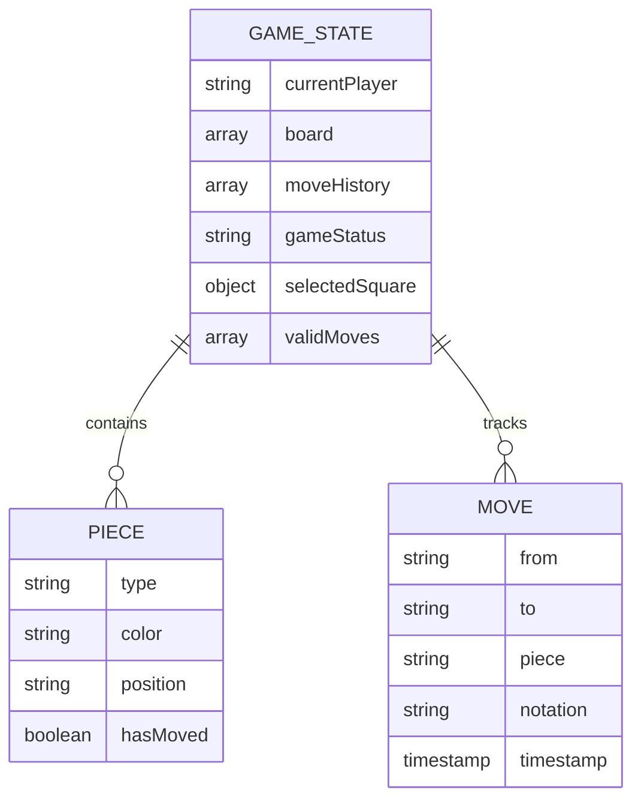

# Modern Chess Game Web Client - Technical Architecture Document

## 1. Architecture design



## 2. Technology Description

* Frontend: React\@18 + TypeScript\@5 + Vite\@5 + Tailwind CSS\@3

* State Management: React Context API + useReducer

* Chess Logic: Custom TypeScript implementation

* Styling: Tailwind CSS with custom chess board components

* Build Tool: Vite for fast development and optimized builds

## 3. Route definitions

| Route | Purpose                                      |
| ----- | -------------------------------------------- |
| /     | Main chess game page with board and controls |

## 4. API definitions

No backend APIs required for this demo application. All functionality is handled client-side.

## 5. Server architecture diagram

No server-side architecture required. This is a pure frontend application.

## 6. Data model

### 6.1 Data model definition



### 6.2 Data Definition Language

TypeScript interfaces for the chess game data structures:

```typescript
// Core game types
type PieceType = 'pawn' | 'rook' | 'knight' | 'bishop' | 'queen' | 'king';
type PieceColor = 'white' | 'black';
type Square = string; // e.g., 'e4', 'a1'
type GameStatus = 'active' | 'check' | 'checkmate' | 'stalemate' | 'draw';

// Piece interface
interface ChessPiece {
  type: PieceType;
  color: PieceColor;
  hasMoved: boolean;
}

// Castling rights interface
interface CastlingRights {
  white: { kingSide: boolean; queenSide: boolean };
  black: { kingSide: boolean; queenSide: boolean };
}

// Move interface
interface Move {
  from: Square;
  to: Square;
  piece: ChessPiece;
  notation: string;
  timestamp: Date;
  captured?: ChessPiece;
  // State tracking for proper undo functionality
  prevHasMoved: boolean;
  prevCapturedHasMoved?: boolean;
  prevCastlingRights: CastlingRights;
}

// Board state (8x8 array)
type Board = (ChessPiece | null)[][];

// Game state interface
interface GameState {
  board: Board;
  currentPlayer: PieceColor;
  moveHistory: Move[];
  redoHistory: Move[]; // Tracks undone moves for redo functionality
  gameStatus: GameStatus;
  selectedSquare: Square | null;
  validMoves: Square[];
  isInCheck: boolean;
  castlingRights: CastlingRights;
}

// Component props interfaces
interface ChessBoardProps {
  gameState: GameState;
  onSquareClick: (square: Square) => void;
  onPieceDrop: (from: Square, to: Square) => void;
}

interface ChessPieceProps {
  piece: ChessPiece;
  square: Square;
  isSelected: boolean;
  isValidMove: boolean;
  onDragStart: (square: Square) => void;
  onDragEnd: (from: Square, to: Square) => void;
}

interface GameControlsProps {
  gameState: GameState;
  onResetGame: () => void;
  onUndoMove: () => void;
  onRedoMove: () => void;
}

// Chess logic utility types
interface MoveValidationResult {
  isValid: boolean;
  reason?: string;
  wouldBeInCheck?: boolean;
}

interface SquareInfo {
  file: string; // a-h
  rank: number; // 1-8
  color: 'light' | 'dark';
  coordinates: [number, number]; // [row, col] in array
}
```

### Component Architecture

```typescript
// Main application component structure
interface ComponentHierarchy {
  App: {
    ErrorBoundary: {  // Error boundary wrapper for graceful error handling
      ChessGame: {
        ChessBoard: {
          ChessSquare: {
            ChessPiece: {};
          };
        };
        GameControls: {
          MoveHistory: {};
          GameStatus: {};
          ActionButtons: {};
        };
      };
    };
  };
}

// State management actions
type GameAction = 
  | { type: 'SELECT_SQUARE'; square: Square }
  | { type: 'MAKE_MOVE'; from: Square; to: Square }
  | { type: 'RESET_GAME' }
  | { type: 'UNDO_MOVE' }
  | { type: 'REDO_MOVE' }
  | { type: 'SET_VALID_MOVES'; moves: Square[] }
  | { type: 'UPDATE_GAME_STATUS'; status: GameStatus };
```

## 10. Check Detection and Legal Move Filtering (Implemented)

- Move validation (utils/moveValidation.ts)
  - findKingPosition(board, color): locate the king square for a color.
  - isKingInCheck(board, color, kingSquare?): determines if a king is attacked by scanning opponent pseudo-legal moves.
  - isMoveLegal(board, from, to, piece): simulates a move and returns false if it leaves own king in check.
  - getValidMoves(...) now filters out moves that would place own king in check.
  - getKingMoves(...) includes full castling validation with safety checks.
- Game reducer (hooks/useChessGame.ts)
  - After MAKE_MOVE: computes opponent check state via isKingInCheck(newBoard, opponent) and sets gameState.isInCheck.
  - After UNDO_MOVE: recomputes isInCheck for the next current player based on the restored board.
  - Handles castling move execution by moving both king and rook.
  - Supports castling move undo by restoring both pieces to original positions.

## 11. Castling Implementation (Implemented)

- Full castling functionality for both king-side and queen-side castling
- Castling validation includes:
  - Castling rights verification (king and rook haven't moved)
  - Path clearance validation (no pieces between king and rook)
  - Safety validation (king not in check, doesn't move through check, doesn't end in check)
- Castling execution automatically moves both king and rook to correct positions
- Undo support properly restores both pieces
- Standard Algebraic Notation support (O-O for king-side, O-O-O for queen-side)

## 12. Redo Functionality Implementation (Implemented)

- Complete redo functionality to restore previously undone moves
- State management:
  - `redoHistory` array in GameState tracks undone moves
  - `REDO_MOVE` action restores moves with full state restoration
  - `UNDO_MOVE` action pushes moves to redoHistory
  - `MAKE_MOVE` action clears redoHistory when new moves are made
- UI integration:
  - Redo button in GameControls component
  - Proper enable/disable logic based on redoHistory availability
- State restoration includes:
  - Board position restoration
  - Captured pieces restoration
  - Move history management
  - Castling rights restoration
  - Turn management

## 13. Testing Architecture

- Testing framework: Vitest with React Testing Library
- Test organization:
  - Unit tests located in `src/**/__tests__/` directories
  - Tests for hooks: `src/hooks/__tests__/useChessGame.test.ts`
  - Tests for utilities: `src/utils/__tests__/chessUtils.test.ts`
- Test commands:
  - `npm test` - Run test suite in watch mode
  - `npm run test:ui` - Open Vitest UI for interactive testing
- Coverage includes:
  - Chess utility functions (coordinate conversion, board initialization)
  - Game state reducer logic
  - Move validation and check detection
  - Castling rights management

